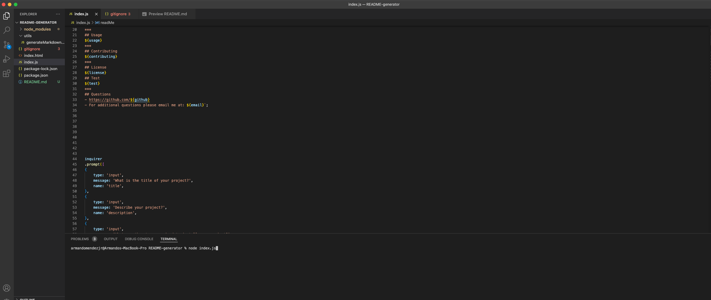

# README-generator
***
## Description
The application allows the user to generate a README file by simply answering a few questions. Each question fills in a section of the file. Formating the file correctly  and coming up with good question took the most time. The application will save the user time 
and make the process of completing a project easier. 
***
## Table of Contents
- [Installation](#installation)
- [Usage](#usage)
- [Contributing](#contributing)
- [License](#license)
- [Test](#test)
- [Questions](#questions)
***
## Installation
No, installation is required.
***
## Usage
Type in 'node index.js' into the terminal. 

***
## Contributing
N/A
***
## License
***
## Test
No
***
## Questions
- https://github.com/armando1236
- For additional questions please email me at: amjr86@outlook.com